# Operationalizing Machine Learning with AzureML Studio by Ikechukwu Ogbuchi

## General Overview
The aim of this project was to create a machine learning model on Microsoft Azure ML to an environment, then consume it through an endpoint. 

It initially involved running an autoML classification experiment, identifying the best performing model on the given Bank dataset(containing information about clients) and then deploying that best model(VotingEnsemble). Then I enable Application insights and was able to read logs and get url’s for scoring and interacting with the API. Then the model was consumed through endpoints by providing the appropriate keys to the environment which consumes it. Swagger UI which open source project to visually render documentation for an API is used in conjunction with docker, a set of platform as service products that use OS-level virtualization to deliver software in packages called containers for the purposes of interacting with the API.

Then we proceeded to automate all of this process through a pipeline created from the Jupyter Notebook. The best model from training was then saved and tested on test dataset. A confusion matrix showing the classification performance was also created, then the process was concluded after a rest endpoint was created from the AutoML pipeline.

## Architectural Diagram
The diagrams below show the architecture of the optimization process:
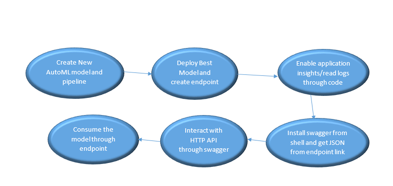
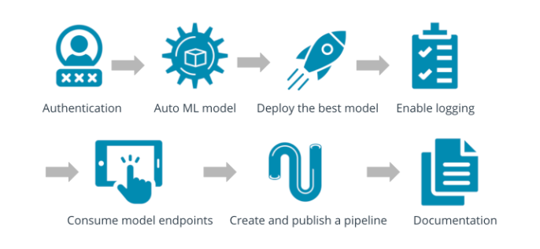

##Data Source
Data used for this experiment was gotten from the link: 
https://automlsamplenotebookdata.blob.core.windows.net/automl-sample-notebook-data/bankmarketing_train.csv

## Key Steps with Images

Here are the Key steps I followed in the entire process with screenshots:

* uploading the dataset and ensuring it is under the registered datasets as shown
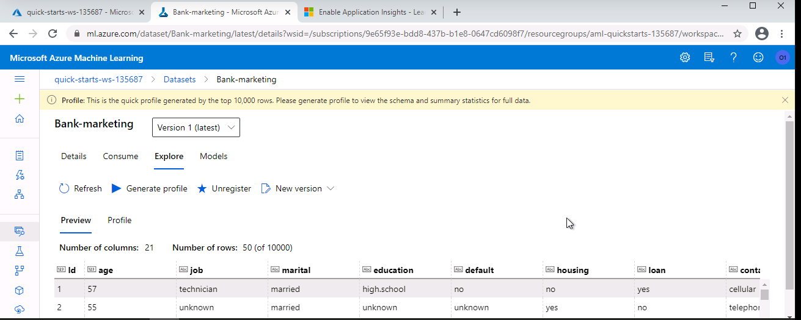
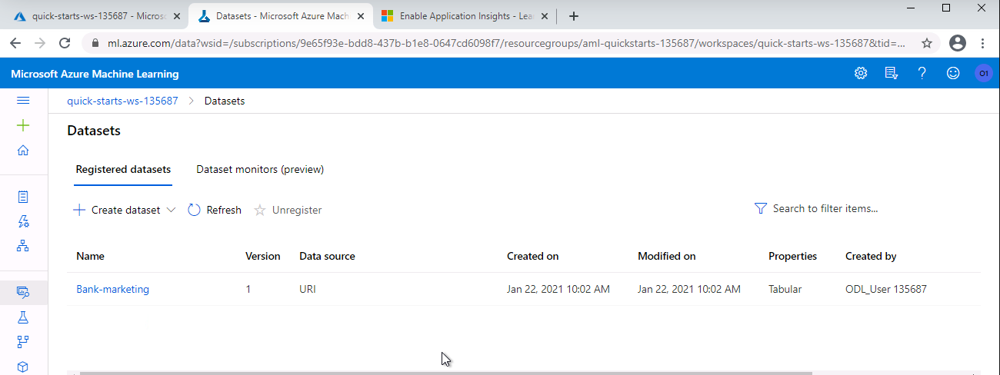

* Creating a New Automated ML run, provisioned a compute cluster and ensured it was complete as shown:
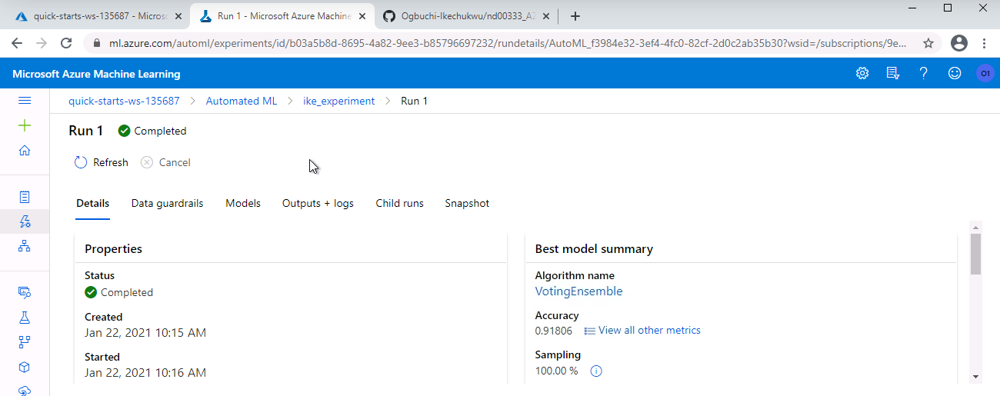
 
* Chose the best model “VotingEnsemble” and deployed it using ACI:
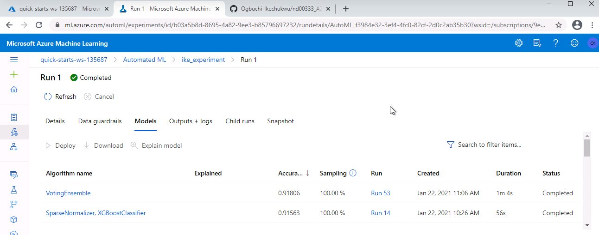

* Enabled the Application Insights, which enabled logging and log outputs:

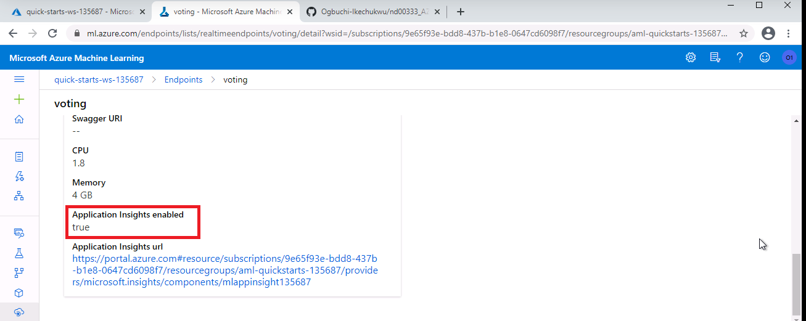
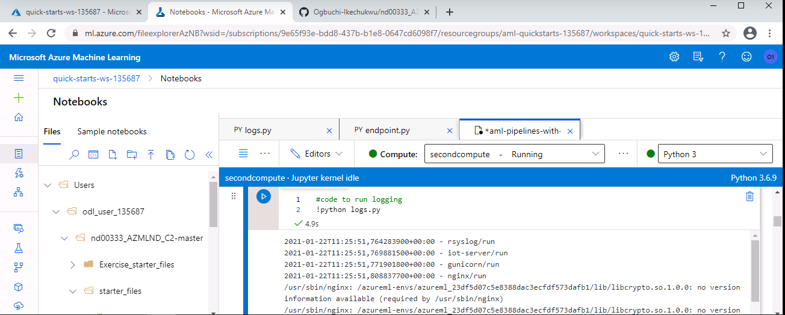
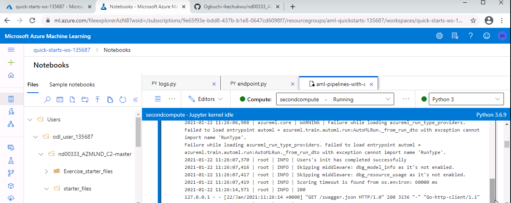

* Then I downloaded latest Swagger image through docker on localhost:9004 and interacted with the documentation to see HTTP API methods as shown:
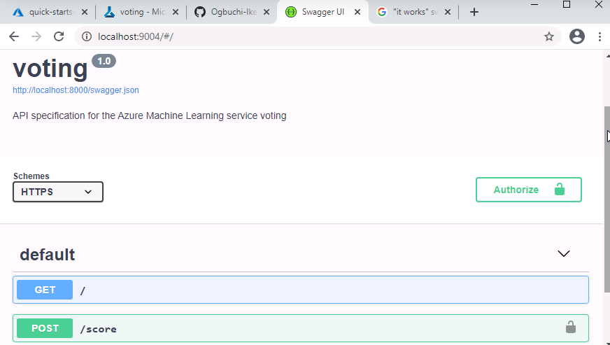
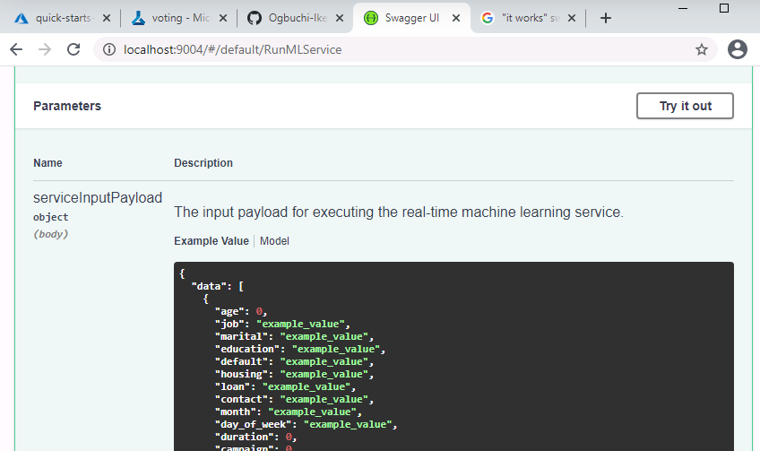

* Then I proceeded to consume the model by modifying the scoring_url and key in the endpoint.py file with credentials from the deployed model. Executing the script through Gitbash after that resulted in the outputs below:
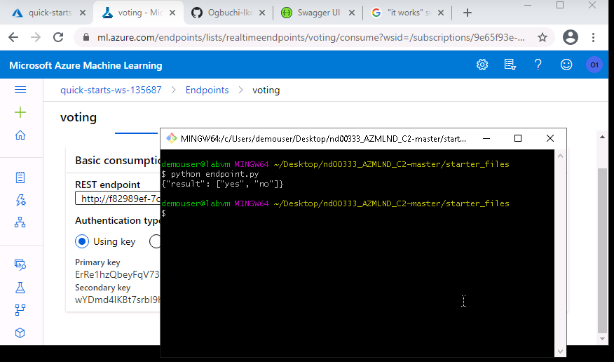

* Then I proceeded to automate all these with the Notebook. I updated all variables, ensured the config.json file was in my working directory, and I ran all the cells and waited for the pipeine to be created.I also verified pipeline was created and running. Here are the screenshots:
1.pipeline created with endpoints
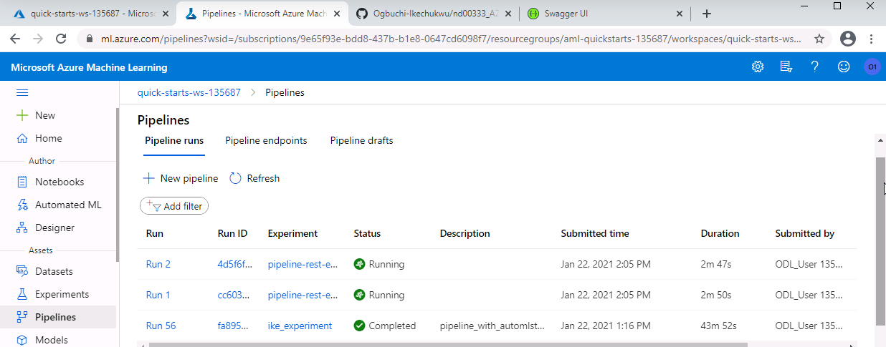
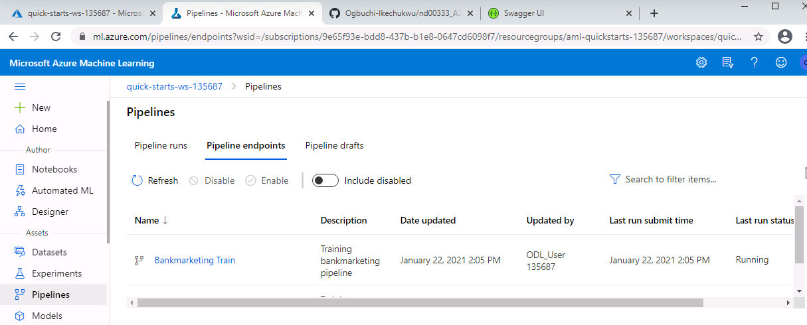
2. Bank marketing dataset with autoML module 
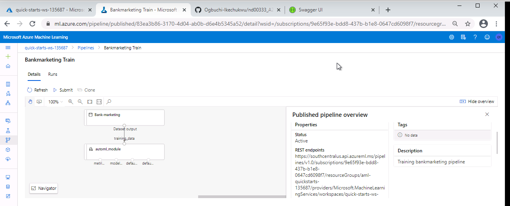
3. Pipeline Overview with REST Active
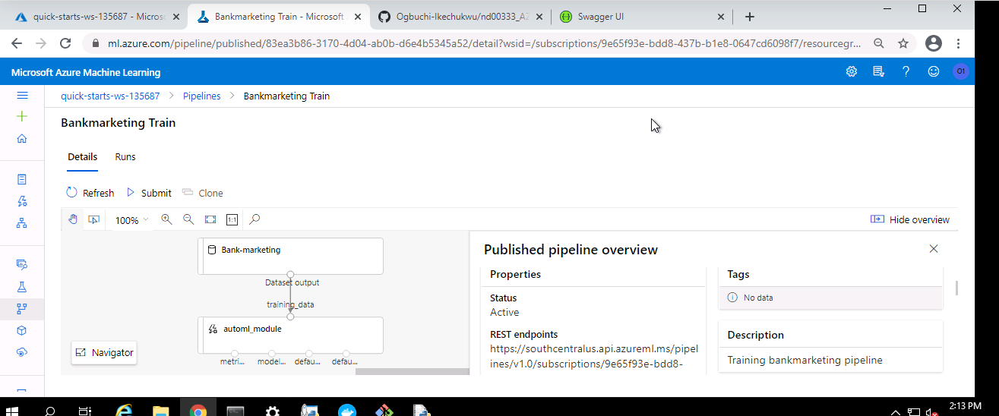
4. Run Details showing from Jupyter Notebook
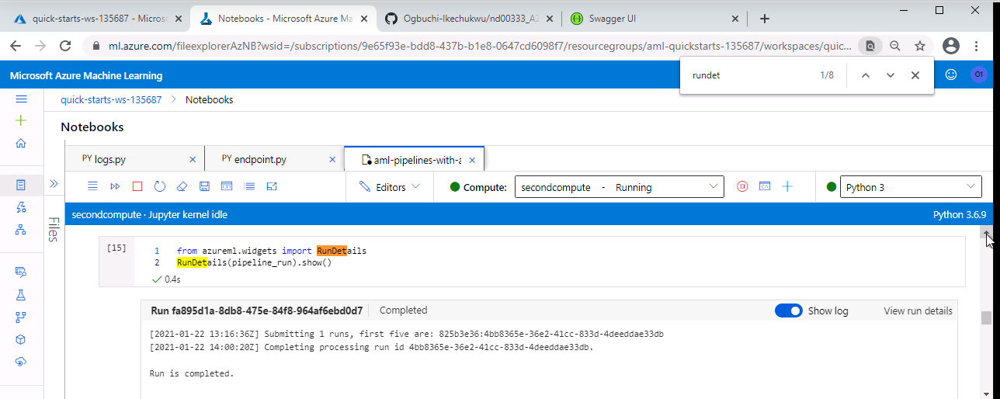
5. ML Studio showing scheduled run
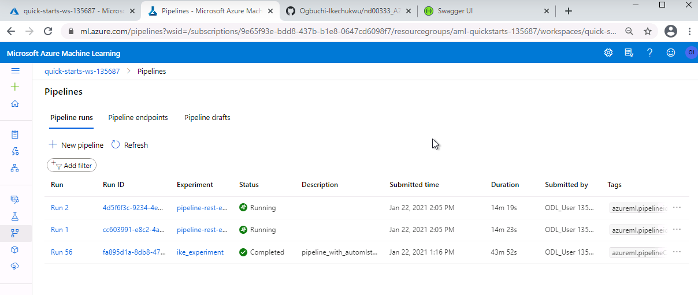

## Short Description to Improve Project in Future

The project can be improved in future through the following ways:
*Not using early stopping and allowing the experiment to run for longer training times
*Getting a larger dataset than the one which was made available for this project
*Performing more feature engineering and preprocessing steps on the dataset to uncover more data patterns
*We can use deep learning and GPUs for future training to enhance the speed of training while giving us better results

## Screen Recording Link
Here is a Youtube Link to my screencast: https://www.youtube.com/watch?v=a78h5g8a9xA

